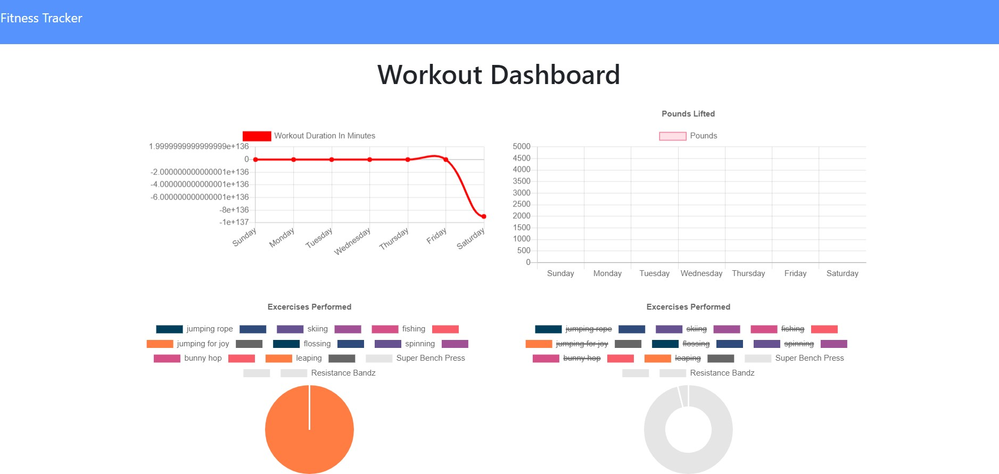
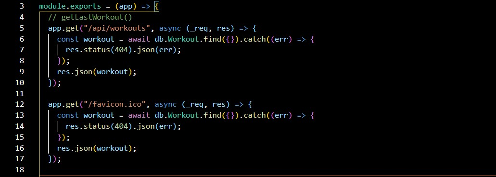

# Workout Tracker - Workout App

## Overview

Workout Tracker is a Workout app that allows a user to track their workout routine using a Mongo database with a Mongoose schema and routes handled by Express.

## Table of Contents

- [Description](#description)
- [Installation](#installation)
- [Usage](#usage)
- [Test](#test)
- [Deployed](#deployed)
- [Tools](#tools)
- [Research](#research)
- [Questions](#questions)
- [License](#license)

## Description

To dynamically and quickly create a workout with exercise data, Express, Mongo with a Mongoose schema, Heroku were utilized to:

- Serve and display a working data base of workouts with excercise(s) started and workouts that have been completed

## Installation

1. Create a .gitignore file and include node_modules, .DS store and .env. This ensures that the node_modules directory and your Atlas credentials aren't tracked or uploaded to GitHub.
2. Use the command-line, npm i, to install Express, dotenv, and mongoose npm and morgan npm.
3. To start creating and completeting workouts using Express, use the command, node server.js and navigate in the web browser to localhost:8080.

## Usage

- Express and Heroku are used to serve and display to the user web pages to create their HTML exercises.
- Path is used to render the HTML.
- Once the user's information regarding:
  - created excercise is inputed into the form:
- An HTML file with the user's added workout and unique id is created.
- /stats route displays the user's completed workouts and total weights lifted.

## Test

Seed the database from the seed.js file by running the command, npm run seed. Then test the different HTML pages/positions on the local host using Morgan npm, to ensure that the routes are firing and the Mongoose database is accessed.

## Deployed

- \*[Deployed website](https://hidden-forest-08236.herokuapp.com/)
- \*[GitHub Repository](https://github.com/Kay0s/WorkoutTracker) 

### Screenshot of Routes/Api.js

## Tools

- mongo DB
- dotenv npm
- Mongoose
- HTML
- CSS
- JavaScript
- .gitignore
- Git Bash
- Heroku
- Express
- node.js
- morgan npm

## Research

- [Mongoose](https://mongoosejs.com/)
- [mongo DB](https://www.mongodb.com/)
- [Mongoose| findByIdAndUpdate() - GeeksforGeeks](https://www.geeksforgeeks.org/mongoose-findbyidandupdate-function/)

## Questions

- [Email](hamilton.kristina@gmail.com)
- [GitHub Profile](https://github.com/Kay0s)
- [GitHub Repository](https://github.com/Kay0s/WorkoutTracker)

## License

© 2021 Kristina Hamilton and Trilogy Education Services, a 2U, Inc. brand. All Rights Reserved. Permission is hereby
granted, free of charge, to any person obtaining a copy of this software and associated documentation files (the
"Software"), to deal in the Software without restriction, including without limitation the rights to use, copy, modify,
merge, publish, distribute, sublicense, and/or sell copies of the Software, and to permit persons to whom the Software
is furnished to do so, subject to the following conditions:

The above copyright notice and this permission notice shall be included in all copies or substantial portions of the
Software.

THE SOFTWARE IS PROVIDED "AS IS", WITHOUT WARRANTY OF ANY KIND, EXPRESS OR IMPLIED, INCLUDING BUT NOT LIMITED TO THE
WARRANTIES OF MERCHANTABILITY, FITNESS FOR A PARTICULAR PURPOSE AND NONINFRINGEMENT. IN NO EVENT SHALL THE AUTHORS OR
COPYRIGHT HOLDERS BE LIABLE FOR ANY CLAIM, DAMAGES OR OTHER LIABILITY, WHETHER IN AN ACTION OF CONTRACT, TORT OR
OTHERWISE, ARISING FROM, OUT OF OR IN CONNECTION WITH THE SOFTWARE OR THE USE OR OTHER DEALINGS IN THE SOFTWARE.
